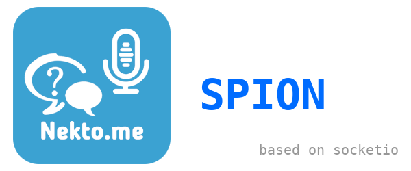

<div align="center">
    <i><b>Шпион для анонимного чата nekto.me, на базе socketio</b></i>
</div>

---
Шпион написан на [Python 3.12](https://www.python.org/downloads/release/python-3110/) и использует [асинхронность](https://docs.python.org/3/library/asyncio.html) что позволяет запускать 2 или больше клиентов одновременно. Он использует библиотеку [python-socketio](https://python-socketio.readthedocs.io/en/latest/index.html), которая дает возможность асинхронного подключения к socketio серверу.

### Принцип работы

Этот шипион работает по принципу атаки MITM (man in the middle). Вот как выглядит это:

< Собеседник 1 > <-> < Клиент 1 > <-> < ВЫ > <-> < Клиент 2 > <-> < Собеседник 2 >

Вы просто перенаправляете сообщения с одного чата на другой.

### Запуск

Чтобы запустить бота вам нужно установить на свое устройство. Чтобы установить на windows перейдите по ссылке: [Python 3.12 (Windows).](https://www.python.org/ftp/python/3.12.0/python-3.12.0-embed-amd64.zip)

Чтобы установить на линукс:
- Arch linux: ```yay -S python312```
- Ubuntu: ```sudo apt install python3.12```

Следущий шаг это настройка файла **config.ini TEMPLATE**:

- Переименуйте на ```config.ini```
- Вам нужно достать 2 токены юзеров из nekto.me/chat.
    - Откоройте вкладку инкогнито, перейдите на этот [сайт](https://nekto.me/chat). Откройте консоль и введите: ```JSON.parse(localStorage.getItem("storage_v2"))["user"]["authToken"]```
    - Пообщайтесь 5-10 раз для того чтобы система nekto.me поняла что вы не бот.
    - И обзятельно сохраните User-Agent из браузера которого вы все это сделали.
- После того как у вас есть 2 токена и User-Agent этих токенов то можно приступать к настройке конфига
    - откройте файл config.ini и в секции ```client/client_name```, измените token и ua на User-Agent.
    - и так-же сделать с ```client/client_name2```.

**Остальные настройки:**

| Название    | Значение            | Пример            |
| ----------- | -----------         | ---------         |
| my-sex      | Пол клиента         | M или F           |
| my-age      | Возраст клиента     | 0,17 или 18,21      |
| wish-sex    | Пол собеседника     | M или F           |
| wish-age    | Возраст собеседника | 0,17 или 0,17-18,21 (если несколько)  |
| is-adult    | 18+ чат             | True или False    |
| role        | Ролка               | True или False    |
| wish-role   | Ищу сюжет или Предлагаю | suggest или search |

> Подсказка: M - это парень, F - это девушка
> Подсказка: Suggest - предлагать сюжет, Search - искать сюжет

### Мой телеграм канал
*Если у вас есть вопросы пишите в телеграм канал*: t.me/progerfromselo 
